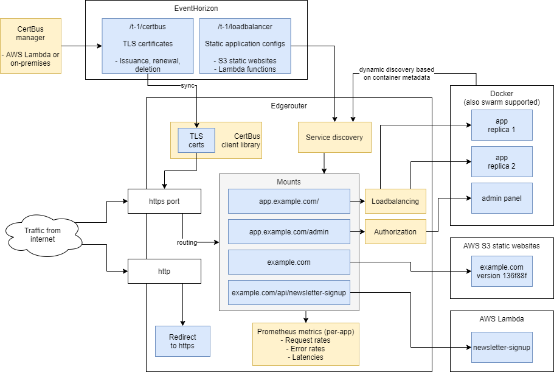

[](https://travis-ci.org/function61/edgerouter)
[](https://bintray.com/function61/dl/edgerouter/_latestVersion#files)
[](https://hub.docker.com/r/fn61/edgerouter/)
[](https://pkg.go.dev/github.com/function61/edgerouter)

Easy clustering-native, multi-tenancy aware loadbalancer for Docker services, AWS Lambda
functions and S3 static websites.



Contents:

- [Features](#features)
- [Documentation](#documentation)
- [Edgerouter configuration](#edgerouter-configuration)
- [Application configuration](#application-configuration)
- [TODO](#todo)


Features
--------

- Prometheus metrics
- Clustering-native
  * All state that is required to exist on all loadbalancer nodes come from an event bus
    (which is durable and has exact-once msg semantics), so each nodes easily reach the
    same config.
- Dynamically discovers Docker services (Swarm and standalone containers supported).
  * Kubernetes is not currently supported.
- [CertBus](https://github.com/function61/certbus) integration for always up-to-date TLS
  certificates
- Emulates AWS API Gateway for calling Lambda functions
- S3 static website support
  * Why use LB in front of S3? Deploys to plain S3 are not atomic. That means users can
    see broken, in-progress, updates or worse yet - canceled deploy can end up in unknown
    state. We support atomic deploys on top of S3 with great caching characteristics.
  * This also makes it possible to overlay dynamic stuff "on top of" a static website.
    Think `/` mounted to S3 but `/api` mounted as a Lambda function.
- Manually defined applications (this hostname should be proxied to this IP..)
- Authorization support
  * For simple websites like (static websites) or backoffice interactive HTTP services that
    you don't have control of (likes of Prometheus, Grafana), it's derirable for loadbalancer
    to enforce hostname-wide authentication.
  * For any advanced use, it's of course preferred to do in-app authentication so you can
    have advanced control of things like different auth interactive vs. API users etc.
- Opinionated
  * Not meant to support everyone's use cases. Do the few things we do, really well.


Documentation
-------------

- [Managing S3 static websites](docs/s3-static-websites/README.md)


Edgerouter configuration
------------------------

Configuration is driven by the following ENV variables:

- EventHorizon access: CertBus + service discovery of static applications
  * `AWS_ACCESS_KEY_ID`
  * `AWS_SECRET_ACCESS_KEY`
  * `CERTBUS_CLIENT_PRIVKEY`, base64 encoded PEM encoded ("----- BEGIN ... -----") private key
  * `EVENTHORIZON_TENANT`, example: prod:1
- Docker service discovery
  * `DOCKER_CLIENTCERT`, base64 encoded PEM encoded ("----- BEGIN ... -----") cert
  * `DOCKER_CLIENTCERT_KEY`, base64 encoded PEM encoded ("----- BEGIN ... -----") private key
  * `DOCKER_URL`, example: https://dockersockproxy:4431
  * `NETWORK_NAME`, example: fn61

EdgeRouter consumes these [EventHorizon](https://github.com/function61/eventhorizon) streams:

- `/t-1/certbus`
  * TLS certificate updates happen here
- `/t-1/loadbalancer`
  * Static application definitions are updated here. "Static" doesn't mean the applications
    don't evolve - it means that they-re semi permanent. The static definition is updated
    each time a S3 static website is deployed. Lambda definitions rarely change.


Application configuration
-------------------------

Services/containers discovered from Docker are mostly
[Traefik-notation compliant](https://docs.traefik.io/v1.7/configuration/backends/docker/),
so labels like `traefik.frontend.rule`, `traefik.port` etc are parsed into an app config.
See [test cases](pkg/erdiscovery/swarmdiscovery/traefikannotations_test.go) for supported directives.

"Static" application configs can be published via EventHorizon and all Edgerouter nodes in
the cluster will pick up the same changes.

All application configs, whether they're dynamically created from Docker or retrieved via
EventHorizon follow this structure:

```javascript
{
  "id": "example.com",
  "frontends": [
    {
      "kind": "hostname",
      "hostname": "example.com",
      "path_prefix": "/"
    }
  ],
  "backend": {
    "kind": "s3_static_website",
    "s3_static_website_opts": {
      "bucket_name": "mycompany-staticwebsites",
      "region_id": "eu-central-1",
      "deployed_version": "v1"
    }
  }
}
```

An application always has an ID, at least one frontend (= hostname or hostname pattern),
and a single backend (one backend can have multiple replicas for loadbalancing/high
availability though).

Here's an example of a Docker-discovered service with 2 replicas (remember, this config is
autogenerated):

```javascript
{
  "id": "app.example.com",
  "frontends": [
    {
      "kind": "hostname",
      "hostname": "app.example.com",
      "path_prefix": "/"
    }
  ],
  "backend": {
    "kind": "peer_set",
    "peer_set_opts": {
      "addrs": [
        "http://192.168.1.2"
        "http://192.168.1.3"
      ]
    }
  }
}
```


TODO
----

- Write docs on how to use all this
- S3: response caching, server caching. Due to our design this optimizes like crazy
  (we know exactly when if and when content in S3 is updated).
- Circuit breaker
- Take into account Docker Swarm's health checks
- Less sucky admin UI
