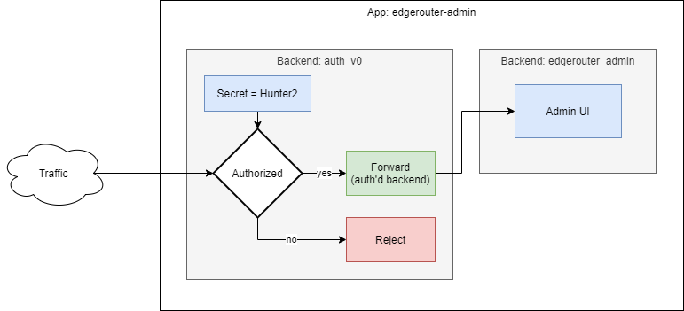
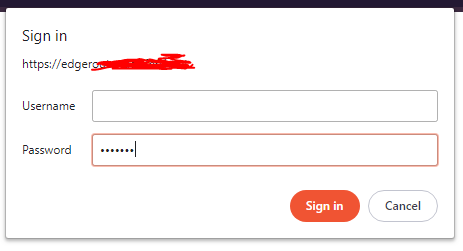

Enabling the admin UI
=====================

As a side effect, this document also discusses authentication.

By default, the admin UI is disabled.

Contents:

- [Choose a hostname for the admin UI](#choose-a-hostname-for-the-admin-ui)
- [Authentication](#authentication)
- [Example app config](#example-app-config)
- [Enabling the app config](#enabling-the-app-config)
- [Machine-to-machine authorization](#machine-to-machine-authorization)


Choose a hostname for the admin UI
----------------------------------

You can decide on which hostname you want to expose the admin UI from.

function61 uses `<service>.<environment>.example.com` pattern for non-customer-visible services.

As an example, let's fill in the blanks:

- Service = `edgerouter`
- Environment `dev` (for development)

Therefore, we would use `edgerouter.dev.example.com`. In our use we already have:

- `*.dev.example.com` DNS entry pointing to the loadbalancer
- `*.dev.example.com` TLS certificate

So we can just plop stuff under that wildcard without needing to mess with DNS or TLS certs.
Your case may be different, so adjust accordingly.


Authentication
--------------

You probably don't want the UI to be publicly visible. We wrap the admin backend with
authentication middleware (it's just a backend that composes another backend inside).

We'll use `auth_v0` backend which basically just uses either Bearer token (= machine-to-machine)
auth or Basic auth (= browser asks for password).

As the secret token (= "password"), we'll choose `Hunter2`.


Example app config
------------------

After making the above decisions, we end up with this app config:

```javascript
{
  "id": "edgerouter-admin",
  "frontends": [
    {
      "kind": "hostname",
      "hostname": "edgerouter.dev.example.com",
      "path_prefix": "/"
    }
  ],
  "backend": {
    "kind": "auth_v0",
    "auth_v0_opts": {
      "bearer_token": "Hunter2",
      "authorized_backend": {
        "kind": "edgerouter_admin"
      }
    }
  }
}
```

This is how the above app config with authorization middleware looks inside Edgerouter:




Enabling the app config
-----------------------

Take the config from above and write it to a temp file (maybe named `admin.json`). Write
it to service discovery:

```console
$ edgerouter discovery put --new < admin.json
$ edgerouter discovery ls
+------------------+--------------------------------------+-------------------------------------------+
| ID               | Frontends                            | Backend                                   |
+------------------+--------------------------------------+-------------------------------------------+
| edgerouter-admin | hostname:edgerouter.dev.example.com/ | auth_v0:[bearerToken] -> edgerouter_admin |
+------------------+--------------------------------------+-------------------------------------------+
```

(Now you can delete the temp file.)

Now, if you visit the hostname, your browser should prompt your for the token:



Leave the username blank.


Machine-to-machine authorization
--------------------------------

As you saw above, the `auth_v0` allows for simple interactive (user) authorization.

We also support bearer token authentication:

```console
$ curl -H "Authorization: Bearer Hunter2" https://edgerouter.dev.example.com/
.. webpage content here..
```
